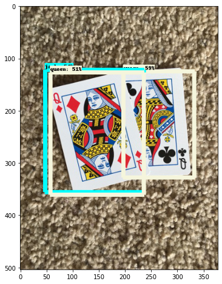
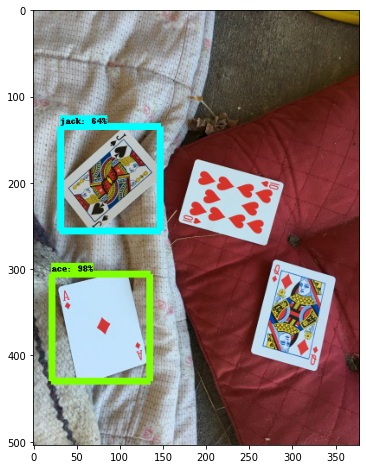

# PlayingCard-Detection
Object detection model built to classify and detect 6 different playing cards like king, queen, ace, ten, nine and jack. Faster RCNN model is used for training 

Data is trainrd over 1000 steps

Some of the predicted results:- 

1. Card-nine

2. Card-Ace

3. Card- Queen

4. Card- Jack

